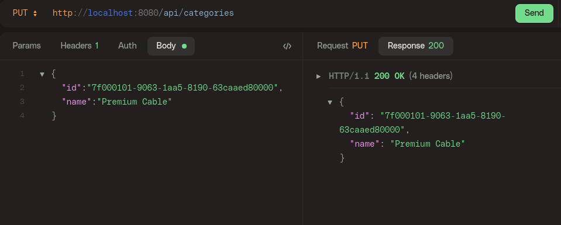
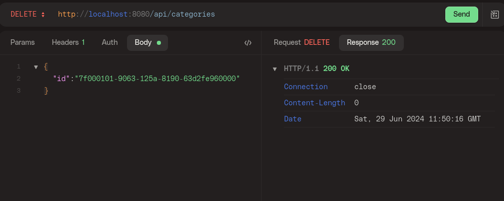
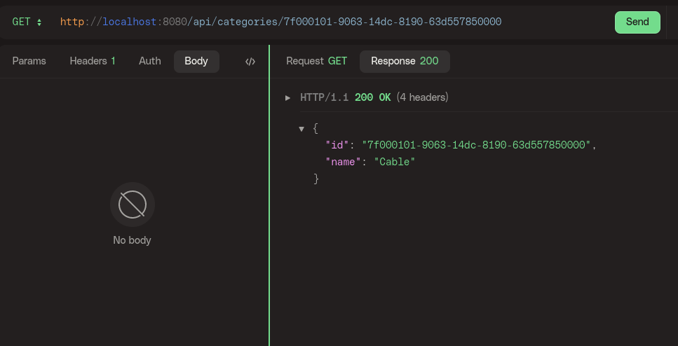
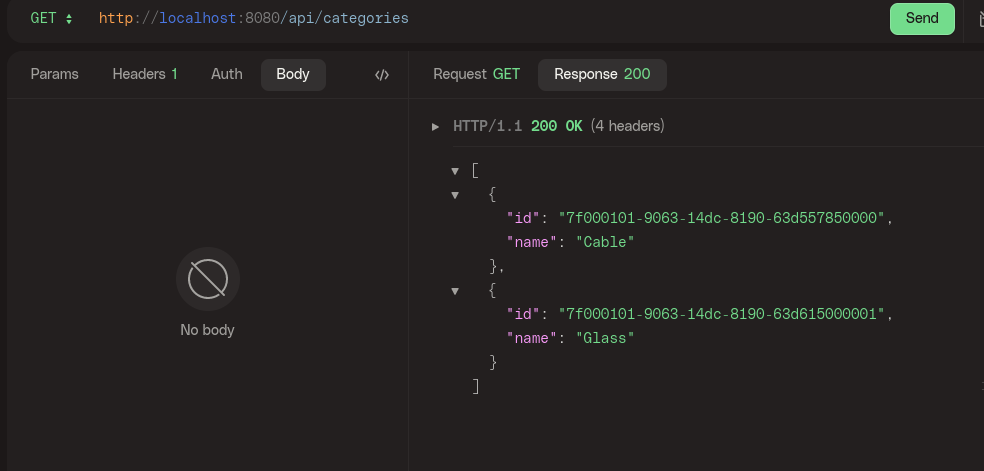

### Example Crud Kotlin Spring Boot
Example code spring boot with kotlin
addon: 
- data migration (https://www.liquibase.com/)
- postgresql

#### Create

#### Update

#### Delete

#### findById

#### FindAll

